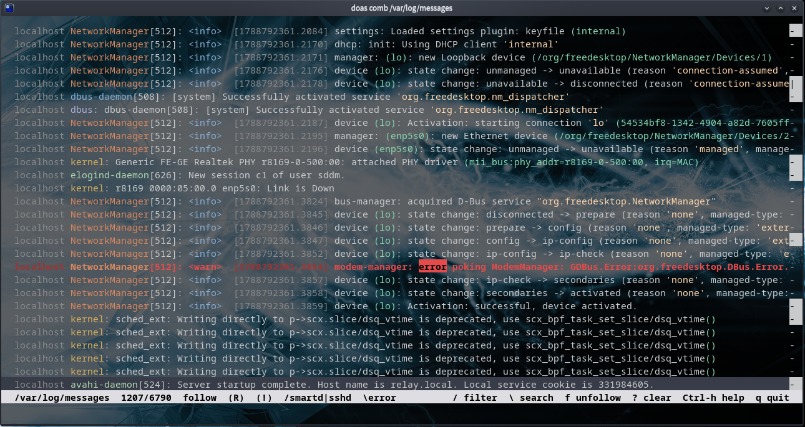

# comb

A small, fast terminal log viewer in plain C; libc only.

When `lnav` is too much, and you'd like a bit more than `less`.

## Features

- severity highlighting (FATAL/PANIC/CRIT magenta, ERROR red, WARN yellow,
  DEBUG/TRACE dim)
- colored highlighting: a loose heuristic tries its best to pick up common patterns
  in logs and applies a rotating color palette to make it easier to parse and read
- incremental `/` filter: literal by default with smart case; `^`/`$` anchor to
  line start/end; Ctrl-R in the prompt switches to POSIX ERE, Ctrl-V excludes
  matching lines instead (grep -v). Simple alternations of plain literals run on
  the SIMD literal path
- highlight-only search: `\` colors matches in place without narrowing; `n`/`N`
  jump between them
- live follow with `poll()`, handles file truncation/rotation
- `w` toggles soft line wrap (h/l/$ horizontal scrolling applies when wrap is off)
- mark lines with Space (x unmarks), copy them all with c/y via OSC 52 (works
  over ssh); falls back to xclip / wl-copy / pbcopy / termux-clipboard-set
- survives file truncation and rotation

## Build & install

    make
    make install        # to /usr/local/bin (PREFIX=... to change)

This also installs the manual page (`man comb`).

## Usage

    comb [-e REGEX] [-t N] [--color=MODE] [FILE]

Reads FILE or piped/redirected stdin. Plain text only.
For systemd journal or compressed logs, pipe them:

`journalctl -o short-precise | comb`, `zcat error.log.gz | comb`

## Documentation

More info is included in the manual:

    man comb

While running, `Ctrl-h` shows a compact in-program version of the key reference.

## Config

Comb has no runtime configuration, but various things like keybinds or colors are easily changeable via `config.h`.

## Tests

    make check                                  # selftests + behavior assertions
    python3 tests/harness.py --check ./comb     # end-to-end assertions (pty)
    python3 tests/harness.py --compare OLD NEW  # byte-diff two builds

## License

0BSD (see LICENSE).
